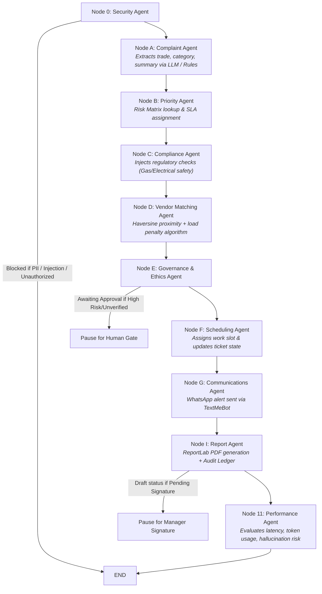
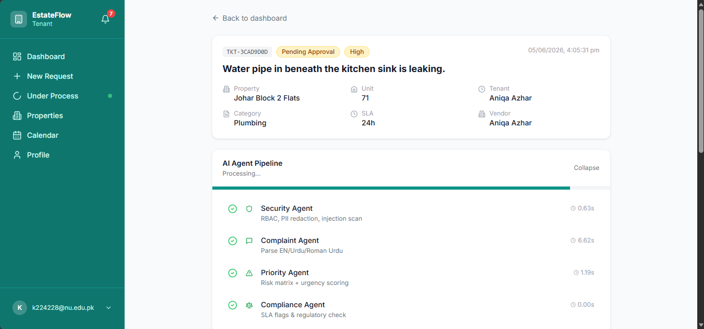
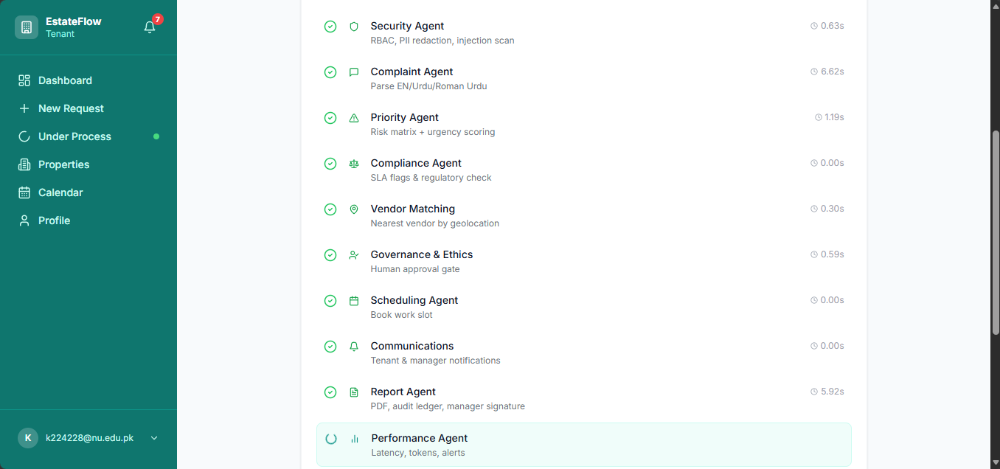
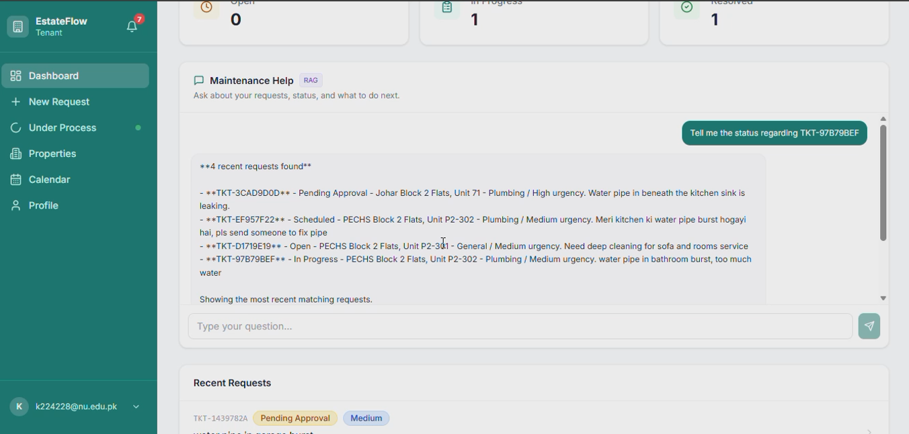
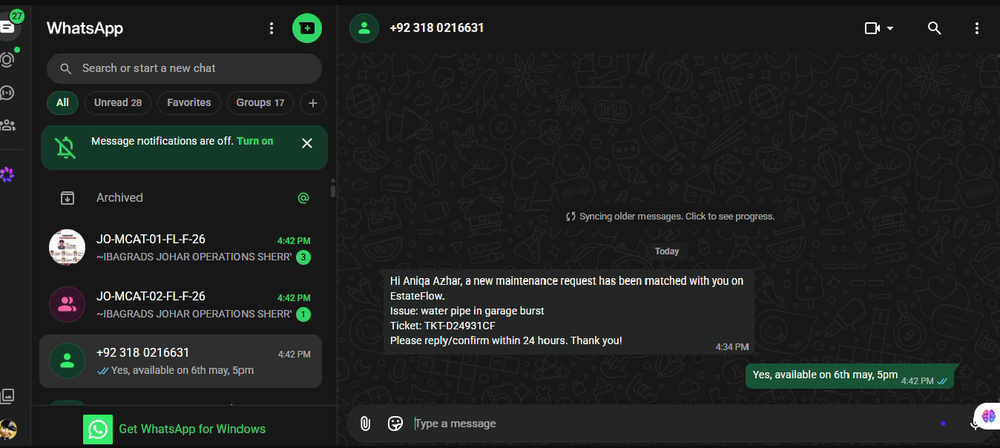
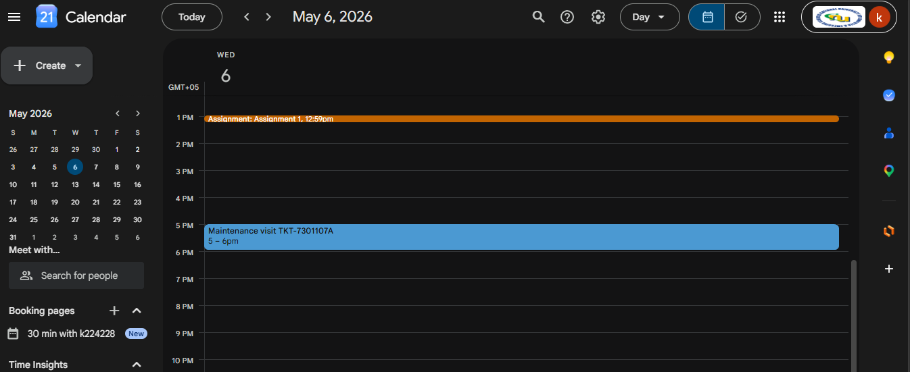

# EstateFlow

## 🚀 Overview

**Estate Flow** is an enterprise-grade multi-agent property management platform designed to automate the complete lifecycle of maintenance request handling. From tenant text/image submission to geolocation-based vendor dispatching, safety compliance checks, human-in-the-loop approvals, and predictive forecasting—Estate Flow turns unstructured maintenance reports into an automated, verifiable, and structured operations pipeline.

### Core Problem Solved
Traditional maintenance is slow, manual, and prone to communication breakdown. Escalations go unmonitored, vendor assignments lack load balancing, and recurring property hazards are missed.

### Key Solutions Brought by Estate Flow
* **Smart Issue Triage:** Multilingual issue classification (English, Urdu, Roman Urdu).
* **Security & PII Redaction:** Automatic scrubbing of sensitive Pakistani identifiers (CNIC, phone numbers, gate codes) before LLM inference.
* **Deterministic Fallbacks:** Hardened rules step in if LLM services time out or fail.
* **Human-in-the-Loop Gates:** Managers review critical safety hazards (gas/fire/flood) and unverified vendor assignments before final dispatch.
* **Automated Audit Ledger:** Immutable step-by-step logs of every automated decision.

---

## 🔥 Key Features

* **10-Node State Machine:** Powered by **LangGraph** for complete visibility and reproducible execution.
* **Pakistan-First Localization:** Built-in CNIC detection, +92 phone format parsing, and Urdu/Roman Urdu NLP processing.
* **Geolocation Vendor Matching:** Haversine distance-based matching with real-time vendor load balancing.
* **Predictive Maintenance:** Weekly background schedulers scanning history to spot recurring trends and flag risks before catastrophic failures happen.
* **Context-Aware RAG Chat:** Vector search over maintenance records for property-level decision-making.
* **Whatsapp communication with vendor:** Communicates maintenance schedules with vendors via whatsapp keeping in mind this is the most frequent and accessible mode of communication in Pakistan for vendors
---

## ⚙️ The 10-Node LangGraph Agent Pipeline

Every incoming maintenance issue flows through a 10-node orchestration pipeline:

```markdown


## Stack

- **Frontend:** React + Vite + TypeScript + Supabase Auth
- **Backend:** FastAPI + LangGraph + OpenRouter (Ollama fallback optional)
- **Database:** Supabase PostgreSQL + Storage

## 🔌 MCP Integration (Google Calendar)

Estate Flow supports external tool orchestration using the **Model Context Protocol (MCP)**:

* **Protocol:** JSON-RPC 2.0
* **Endpoint:** `https://calendarmcp.googleapis.com/mcp/v1`
* **Functionality:** Dispatches structured event payloads containing vendor assignment data, property location, and SLA timeframes directly to property manager calendars.


## Prerequisites

- Node.js 18+
- Python 3.11+
- Supabase project (schema applied)
- OpenRouter API key

---

## 🌟 Visual Overview

### 🤖 Live Agent Pipeline Visualizer


*Real-time execution tracking across the 10 sequential AI agents during maintenance request processing.*

---

### 💬 RAG Chatbot Interface

*Natural language Q&A for tenants and managers powered by pgvector embeddings and RAG.*

---

### 📱 WhatsApp Automation & Vendor Dispatch

*Instant, non-blocking WhatsApp dispatches to vendors with 24-hour response confirmation loops.*

---

### 📅 Google Calendar Scheduling (MCP Integration)

*Seamless work-slot scheduling and availability sync using Model Context Protocol (MCP).*

---

## Environment files

**Backend**

```env
SUPABASE_URL=https://xxxx.supabase.co
SUPABASE_ANON_KEY=eyJ...
SUPABASE_SERVICE_ROLE_KEY=eyJ...
SUPABASE_JWT_SECRET=your-jwt-secret
OPENROUTER_API_KEY=sk-or-...
OPENROUTER_MODEL=meta-llama/llama-3.1-8b-instruct:free
CORS_ORIGINS=http://localhost:5173
```

**Frontend**

```env
VITE_SUPABASE_URL=https://xxxx.supabase.co
VITE_SUPABASE_ANON_KEY=eyJ...
VITE_API_URL=http://localhost:8000
```

## Backend

```powershell
cd backend
python -m venv .venv
.\.venv\Scripts\Activate.ps1
pip install -r requirements.txt
uvicorn app.main:app --reload --host 0.0.0.0 --port 8000
```

API docs: http://localhost:8000/docs

## Frontend

```powershell
cd frontend
npm install
npm run dev
```

App: http://localhost:5173


## Project structure

```
EstateFlow/
├── backend/app/          # FastAPI + LangGraph
├── frontend/src/         # React UI
├── supabase/migrations/  # SQL schema + RLS
└── README.md
```

Built with ❤️ for automated, reliable, and intelligent property management operations.
